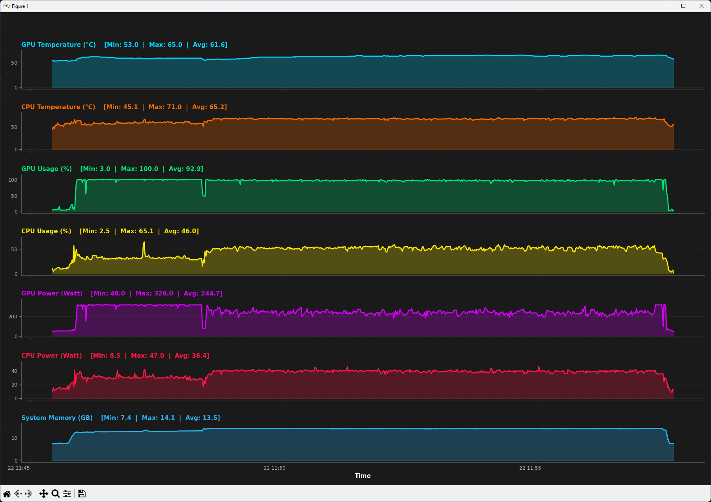

# Hardware Performance Log Visualizer

This project is a Python script that reads log files in `.csv` format (AMD Adrenalin), which record computer hardware performance second by second, and visualizes the data using modern, dark-themed bar charts.

## 🚀 Features
* **Dark Theme and Modern Interface:** A color palette that ensures high readability.
* **Automatic Statistics:** Dynamic calculation of Minimum, Maximum, and Average values for each hardware component.
* **Categorized Metrics:** Separate graph sections for CPU/GPU Temperature, Utilization Rates, Power Consumption, and System Memory.

## 📸 Screenshot

## 🛠️ Installation and Usage

1. Clone the repository to your computer:
2. Copy the log file recorded by AMD Software to the repository folder and rename the file to “log.csv”.
3. Run the plot.py Python script.

----------------------------------------------------------------------------------------------------------------------------------------------------------------------------------------------------------------------------

# Donanım Performans Log Görselleştirici

Bu proje, bilgisayar donanım performansını saniye saniye kaydeden `.csv` formatındaki log dosyalarını (AMD Adrenalin) okuyarak, verileri modern ve karanlık temalı alan grafikleriyle görselleştiren bir Python betiğidir.

## 🚀 Özellikler
* **Karanlık Tema ve Modern Arayüz:** Yüksek okunabilirlik sağlayan renk paleti.
* **Otomatik İstatistikler:** Her bir donanım bileşeni için Minimum, Maksimum ve Ortalama değerlerin dinamik hesaplanması.
* **Kategorize Edilmiş Metrikler:** CPU/GPU Sıcaklığı, Kullanım Oranları, Güç Tüketimi ve Sistem Belleği için ayrı grafik alanları.

## 📸 Ekran Görüntüsü

## 🛠️ Kurulum ve Kullanım

1. Repoyu bilgisayarınıza klonlayın:
2. AMD Software tarafından kaydedilen log dosyasını repo klasörüne kopyalayın ve dosya adını "log.csv" olarak güncelleyin.
3. plot.py phyton betiğini çalıştırın.
